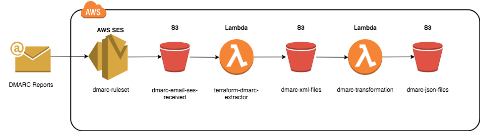

DMARCLESS - Serverless DMARC solution
==========================================================

DMARCLESS is a fully working serverless DMARC solution built on AWS.

Requirements
--------
DMARCLESS requires to have the email mamanged by AWS SES. The infrastructure is deployed using Terraform.
Two Terraform modules are needed, AWS and archive to generate ZIP files. The Terraform user needs to have enough permissions to deploy the infrastructure on AWS.

AWS Arquitecture
--------
DMARCLESS is based on AWS SES rule set to send DMARC reports emails received into an S3 Bucket (dmarc-email-ses-received).

The bucket has an event set to trigger the first lambda to extract the compressed XML file and to store this on a second bucket (dmarc-xml-files).

This bucket has an event set to trigger the transformation lambda to convert the XML report file into individuals JSON files.

Terraform Deployment
--------

To deploy the infrastructure on AWS, run the following commands on the same location as the dmarc.tf file:

``terraform init``
``terraform apply``

The following variables are defined on the terraform file:

* AWS Access Key
* AWS Secret Key
* AWS Region
* Email to receive dmarc reports that is configured on the DNS.

🚨 WARNINGS ️🚨
--------
This solution creates and activates an AWS SES ruleset. Only one ruleset can be active at a time so this
will enable the ruleset created by DMARCLESS and will make the existing ruleset inactive.

There is currently no solution for this as Terraform ruleset information cannot be imported so that
a rule cannot be created to be added into an existing ruluset.

Notes
-----------

* Source code to be released at the conference `NavajaNegra 2018 <https://www.navajanegra.com/2018/>`_
